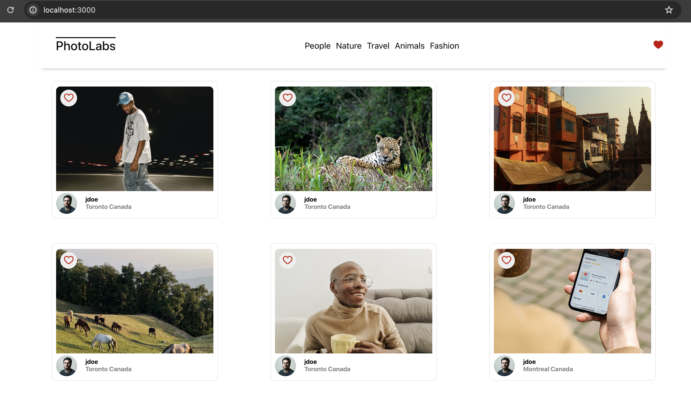
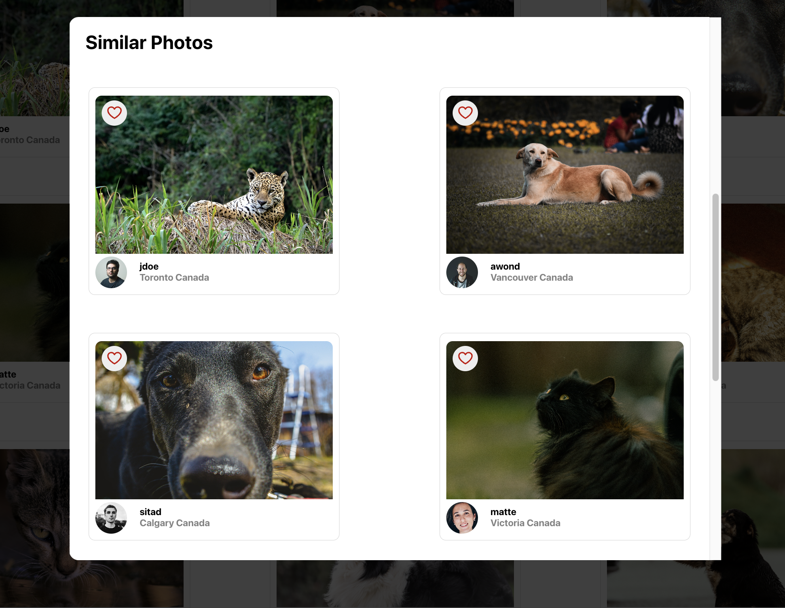
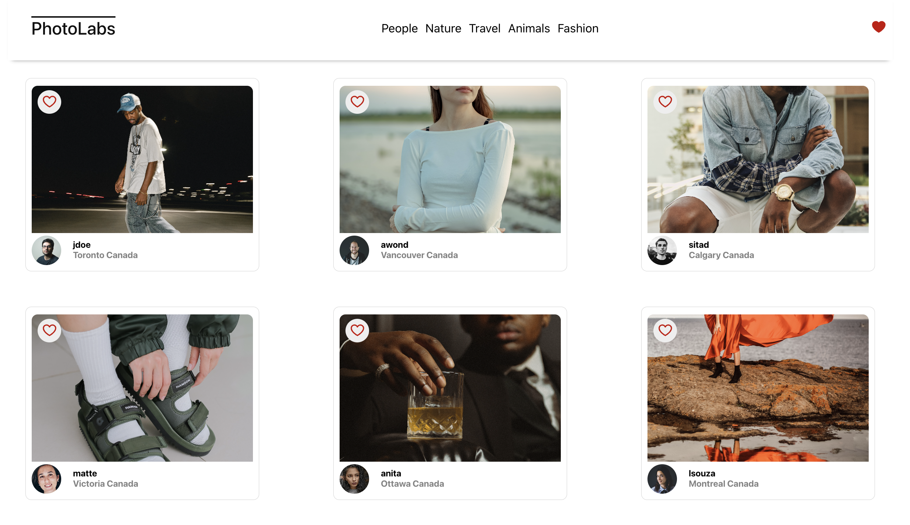

# react-photolabs
The PhotoLabs project for the Web Development React course programming.

# Photolabs
PhotoLabs is a dynamic web application that enables users to explore curated photographs with ease. 

Featuring a user-friendly interface, users can view larger images, discover similar photos, and filter content by topics like animals, travel, fashion, and more. 

With its diverse collection and intuitive features, PhotoLabs offers photography enthusiasts a compelling platform for immersive exploration and discovery.

## Features

  * Liking photos
  * Display liked photo notification
  * View large image
  * Find similar photos
  * Filter photos based on topics

## Stack

  * React
  * JSX
  * Babel
  * Webpack
  * Express
  * SCSS

## Setup

Install dependencies with `npm install` in each respective `/frontend` and `/backend`.

### [Frontend] Running Webpack Development Server

```sh
cd frontend
npm start
```

### [Backend] Running Backend Servier

Read `backend/readme` for further setup details.

```sh
cd backend
npm start
```

### Welcome to PhotoLabs


### View Larger Images

What a good boy!


### Find Similar Photos
Want to see more?!


### Filter Photos By Topics
View photos based on topics like animals, travel, fashion and more! 
#### Animals

#### Travel
 
#### Fashion
 
### More
